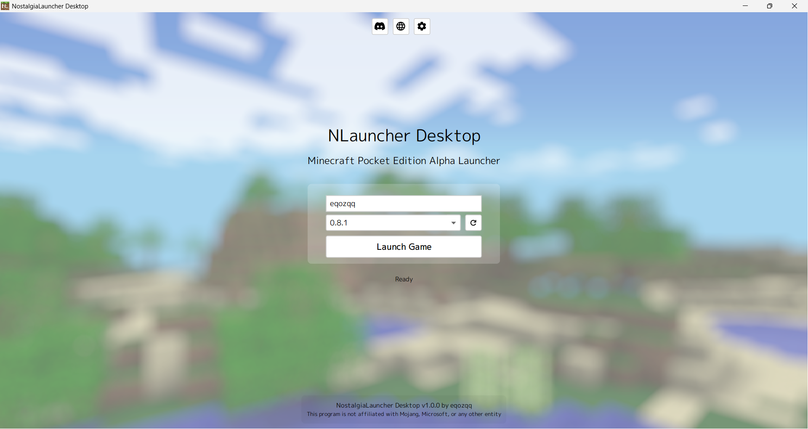

This repository is no longer maintained. See: [https://github.com/NLauncher/NostalgiaLauncherDesktop](https://github.com/NLauncher/NostalgiaLauncherDesktop)
# NostalgiaLauncher Desktop
Minecraft PE Alpha versions launcher for Windows

## How it works
NostalgiaLauncher Desktop uses [Ninecraft](https://github.com/MCPI-Revival/Ninecraft) to run Minecraft PE versions.

## Screenshot

